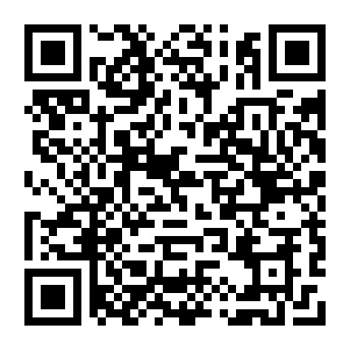

# DAO 探索之路：让每个人活出自己

—— 路漫漫其修远兮，吾将上下而求索 ——\

### **一、重启新世界的大门**

我是密码学专业，11年就接触了比特币，但只站在技术角度理解和观望；

13年炒过币，但对投机环境非常失望，我认为这个圈子早已失去技术朋克的理想，立场走人；

直到17年币市大火，我于产假期间在朋友的安利下，重新接触以太坊、区块链、智能合约，这次被完全震撼惊艳了！

结合几年互联网创业和工作经验，加上有共同信仰、来自各行各业的小伙伴，区块链及智能合约打开了我对新世界的想象，我如饥似渴的补学习新知识，通过为 ethfans 翻译若干篇文章（在此非常感谢 ethfans 几位同学早期引导），逐渐开启对新世界的认知。

[《干货 | USV: 胖协议》](http://mp.weixin.qq.com/s?\_\_biz=MzIwODA3NDI5MA==\&mid=2652524929\&idx=1\&sn=a1772de10c1ee665e1573f98769e24d2\&chksm=8ce652dcbb91dbcaae965b107cbbbb8147b45601cba7ffd06b7e9d3c309f127882565a960edc\&scene=21#wechat\_redirect)

[《科普 | 以太坊代币入门指南》](http://mp.weixin.qq.com/s?\_\_biz=MzIwODA3NDI5MA==\&mid=2652524900\&idx=1\&sn=7d332b2a5bdf8490fa750332762ae7ac\&chksm=8ce65239bb91db2f348db163f82f7ac0e93990f22bfae5ed7e5216d7e38e7d1aaaf3c1e55cf3\&scene=21#wechat\_redirect)

[《科普 ｜ 以太坊概况》](http://mp.weixin.qq.com/s?\_\_biz=MzIwODA3NDI5MA==\&mid=2652524985\&idx=1\&sn=4682f24f32c7765715f93782639ba3d6\&chksm=8ce652e4bb91dbf2eefceec85095d7db3daa41bcdc53ddabab39996acf4fbfa1b5eb8259a8d5\&scene=21#wechat\_redirect)

[《Grid+ | 能源市场的未来》](http://mp.weixin.qq.com/s?\_\_biz=MzIwODA3NDI5MA==\&mid=2652525016\&idx=1\&sn=4414d3e0c23f3c123a8a0edfa1044a61\&chksm=8ce65285bb91db93348ea7286ed9d1b8eca29e79ec0e3c34d9d24586786c6763b6f0bcf3d976\&scene=21#wechat\_redirect)

### **二、DAO 的初始萌芽和探索**

为了加深区块链学习，我申请成为 17 年火爆的 Status 项目中国社区经理（兼职），阅读并翻译 Status 发起人 Jarrad 的[《Status: 口袋中的以太坊》](http://mp.weixin.qq.com/s?\_\_biz=MzI2MTg2Njg4Nw==\&mid=2247483728\&idx=1\&sn=447ce21d6b3ce2fe0cc260f63d0dca09\&chksm=ea5295b8dd251cae4ee91dce96de4cc913d1b91604a8303bbcf45f33684c621b0fe536db27f8\&scene=21#wechat\_redirect)，也算我的 DAO 启蒙。我深度接触了 Status 核心团队，也第一次深度接触基于 DAO 精神和链上信任的全球协作。

Status 的 bounty hunters 模式给我深深的震撼，很多开发者像中世纪小说里自由正义的赏金猎人，做任务换 token，自由的工作生活（不需要在大城市打工，可以在老家边陪伴家人边在线工作）。

但开发团队浓厚的 Geek 风格、社区追涨杀跌的投资（机）风格，我被两股文化冲击着、无所适从。我困惑 DAO 如何找到不同圈层的治理平衡。当时 Status 全球运营负责人 Chris 回复：最终的 DAO 不会有传统组织的一些特征，社区可以领导它，只是我们还没到那里。

\
来看到 Allen 发表的那篇振聋发聩的 DAO 文章[《我为什么必须要做一个DAO的区块链学习社群？》](http://mp.weixin.qq.com/s?\_\_biz=MzI3Mjk1OTIxNA==\&mid=2247483689\&idx=1\&sn=4aa40bb8169233bb5c05f0a45540cd60\&chksm=eb2bd2a8dc5c5bbe1f03a14792d55ae2737e53365b84496e6dafea439c269100d9971004c88c\&scene=21#wechat\_redirect)，在当时国内浮躁的圈子播下一颗纯粹的 DAO 种子，我认为属于国内“平民 DAO”思想的一次觉醒。

于是我有幸加入 DAOONE（加入时还没有名字），成为第一批发起人，认识了国内一群非常纯粹的 DAO 理想主义者。当时我参与产品开发组，与几位开发小伙伴（Joel、牛排等、还有可爱的鼓励师轻轻听）做了「巴别塔」系统（类似 Aragon 或 DAOhaus）。

然而随着社区快速涌入大量成员，早期治理规则不清晰，社区内部逐渐分化成 N 派，比如技术派、制度派、投研派、学院派，共识越来越难达成，gap 越来越深。加上 DAO 工具不完善（比如开发团队虽然做出了钱包、小程序），但远远远远无法支撑社区的裂变扩张。\

在参与 DAOONE 一次上海线下 meeting 后，随着18年熊市加速，DAOONE 仿佛一朵绚烂的昙花，从我的世界逐渐消退。\

然而，DAO 这颗火种却埋在太多人心里，有些仍在行业深耕，有些选择读博从学术角度探索、有些参与国外更成熟 DAO、有些回归原有行业对比实践。\

### **三、DAO思想的初步实践**

18年后，虽然币市陷入熊市，但链圈的底层基础设施建设却如火如荼。经过几年发展，区块链在金融、加密艺术、贸易、物流、知识产权、医疗、证券、法律、教育等多个行业，从空想到逐渐落地，将信息互联网重构成信任互联网。

如果说，智能合约就像一道闪电，击中我的大脑，让我的认知提升 N 个 level；而 DAO 就是一股生生不息的暖流，不停滋润和丰富我的生命（就是生命这个词😂）。每当我工作生活遇到问题，我总能在 DAO 找到答案。DAO 承载我对美好生活的一切想象：自由、平等、公平、民主、透明、利益共享。

我在扇贝负责留声英语时，就（偷偷）运用了 DAO 治理思想。现在看来，有点接近「蔚来汽车」的用户社区模式。开始确实起到较好效果：

* 课程选题经过用户的内测投票 --> 产品口碑很好
* 部分内容「众包」给核心用户撰写（支付报酬） --> 课程生产速度和质量得到保障
* 在用户中选拔小班长参与社群管理 --> 员工、小班长、用户关系融洽

所以留声初期业务增长很快。但由于金字塔管理制度、文化不兼容、商业模式变化等原因，DAO 思想难以继续迭代、验证、发展。

虽然 DAO 模式难以在公司体系下发展，但 DAO 威力却让我暗暗吃惊。我们在公司内，经常讲「坦诚透明」，这样会大大提升组织效率。但如果我们对用户也「坦诚透明」呢？哪怕小一部分核心用户，把二元对立，变成共生共赢；如果投资人再加进来，从用户、员工、投资人三方博弈，变成三位一体呢？

### **四、DAO 让每个人活出自己**

现在，互联网上信息泛滥、信任缺失、数据霸权加剧，古典互联网平台和生态建设者的冲突加剧（比如淘宝和卖家、美团和骑手、滴滴和司机、阅文集团和作者），公司间竞争导致行业愈加内卷、管理者愈加疲惫、员工 996 和 35 岁焦虑、用户被海量真假信息冲击、AI 又催生大量的“无用阶级”，N方博弈导致的N输，每个人都被困在系统里，动弹不得…

无论是传统商业还是互联网经济，都奉承“客户是上帝”“以用户为中心”，那创造价值的员工和服务者又在哪里？Ta 们为何不是上帝、不是中心？正如利兹卡尔顿酒店所说：如果我们的员工不是 ladies and gentlemen，我们如何服务好 ladies and gentlemen.

而随着零工经济的爆发、疫情加速 remote working、Z世代的 YOLO 圈层文化、元宇宙（混合现实）时代的到来，我相信 DAO 将成为下一代组织形态的解决方案。每个人都可以在自己感兴趣的 DAO （社群）之间自由穿梭、工作、生活，让每个人活出自己。

DAO（Decentralized Autonomous Organization），作为区块链技术应用的一种形式、一种全新的人类组织协作方式、正成为生产关系的一次变革型的进化。\

我们已经看到未来世界的雏形，未来已经到来，只是尚未流行。我们不高估新技术未来 2 年的价值，也不能低估未来 10 年的价值。\

今年，我想抛弃一些刻板标签，突破一些束缚和枷锁，重新出发，在寻找 DAO 的路上、寻找自己。有幸，遇见一群同行的小伙伴、大伙伴们。\

最后感谢在寻找 DAO 、寻找自己路上给我指引、探讨、支持、共同前进的同伴们：17年共同探讨区块链的小伙伴们、ethfans 小伙伴们、daoone 小伙伴们、扇贝小伙伴们、创见小伙伴们、我的家人朋友们，还有现在准备一路同行的 EnlightDAO 小伙伴们......

******EnlightDAO**EnlightDAO 是一个社区驱动的、共创和共享的分布式自治社区。我们希望通过自由、坦诚、精进和共生的价值观，共同建设新一代基于区块链的学习社区和 DAO 商业基础设施。共创未来，共享价值！

👆 关注 EnlightDAO 公众号

点击菜单【加入社区 - 联系我们】

添加管理员微信

开启你的区块链和 DAO 学习之旅吧\~

\
