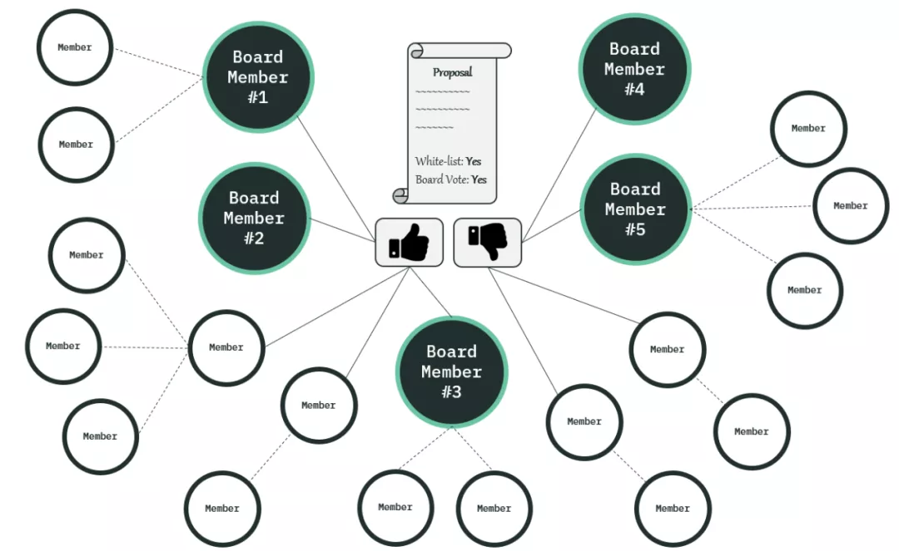

# 为什么想做 EnlightDAO？数字游民的新生活工作方式

### **一、什么是DAO？**

DAO（去中心化自治组织）是互联网原生组织，由社区通过透明的决策过程运行和管理；

DAO 改变的是生产关系，是传统公司制/自上而下管理的一种未来替代；

DAO 是具有共享股权结构表和银行账户的互联网社区；

DAO 利用区块链使社区中的每个人都能对关键的治理和资源管理决策提出意见，并交由利益相关者（社区）共同讨论决定。\

### **二、我眼中的DAO**

我觉得任何一个社区都可以成立一个 DAO —— 自驱型的社区。社区内部共同管理 DAO 内资源，共同为 DAO 贡献价值，共同享有 DAO 的利益。

DAO 首先是价值认同的群体的集合。因为 DAO 是一种自驱型组织，社区成员只有拥有共同的价值观和愿景，才可能持续努力的做出贡献。社区成员才有归属感和认同感。这里的“价值认同”可以是短期的炒作，也可以是长期的“共产主义理想”。

DAO是一种分配方式，包括权利分配和利益分配。利益相关者拥有 DAO，对 DAO 的所有决策负责。DAO 作为一种组织，必然需要价值的输入和利益的分配。

理想化的 DAO 应该是对社区每个提案都应该做出“反应”，yes or no。任何资金的分配一旦经过 DAO 做出决策，将由代码自动执行。

DAO 是一张随机概率统计结果，DAO 的本质是非合作博弈和去信任化机制。这两点可以引爆整个组织活力和资本规模的重要支撑。

DAO 是由单独的个体组成的组织，个体可以是分散的互不认识（或不熟悉）的人。每个人都需要对提案（决策）根据自身利益作出独立判断。在这种情况下，每个人的决策看似杂乱无章，但是整体决策是符合一个确定性结果。

DAO 是具有新陈代谢的有机体。任何决策都是 DAO 的决策，利益相关者权重不同，对决策的影响力也不同。当一个 DAO 的成员数量足够小，个体手中的决策权（投票权）过大时，DAO 会更倾向于现代公司制度。DAO 的新鲜血液必然是因为 DAO 的愿景和利益的吸引。

DAO 成员的进入/退出机制同样需要投票决定。当成员对加入的 DAO 不再认同或者 DAO 觉得某个成员不适合时，每个人都可以做出选择：\

* DAO 的怒踢（强制某个成员退出 DAO）：引起公愤；引起多数成员不满
* DAO 的怒退（个体主动退出 DAO）：理念不同；非公正待遇
* 监禁（个体无决策权）

DAO 是一套自动运行的代码，DAO 把制度/规程都智能合约化。DAO 成立之初都约定好了，不可篡改，决策通过投票。这就是现在最火的 DAO 平台建设，包括 Aragon，DAOStack，DAOhaus，bts，Moloch 等。\

### **三、EnlightDAO 初心**

链圈或者币圈的人可能都听说过 web3、去中心化、去信任化、DAO。在我看来，去中心化和去信任化是一种底层基础，DAO 是基于底层基础的组织形态，web3 是未来理想国。

加入一个 DAO，每个人的出发点不一样，有的人为发币暴富，有的人为蹭热点包装自己的项目，有的人想做个实验，有的人可能就 all in 为理想。

我认为的 DAO 是摆脱了公司制的早九晚五的工作方式，管理层将从看门人的角色转变为推动者的角色。社区中每个人的权利/义务是明确的和平等的，做多少贡献获得多少收益/荣誉，没有勾心斗角，没有尔虞我诈的糟心事。

每个人都可以参加 N 个 DAO，为 N 个项目做贡献，从 N 个渠道获得收益。数字游民在 DAO 生态系统中壮大并将成为贡献的主力。每个人找到自己喜欢的游荡的方式，用你拥有的资源/能力换取你需要的收益/权益/荣誉。DAO 可以为社区成员提供可持续的现实生活保障和满足成员精神需求。\

\

EnlightDAO 由 微光学习社区的想法 DAO 化演变而来。微光社区作为区块链、DAO用户的播种者，再加上发起人的“去中心化”，很自然的想到要把微光社区 DAO 化。使用现有 DAO 治理平台、token 和 NFT 机制，构建适合学习社区的 DAO。

基于上述愿景，EnlightDAO 想培育一个海量的数字游民社区，为具有一定技术背景、学习能力强的新手提供了解区块链、web3、DAO的途径。未来可成长为全球性的教育培训类DAO。

根据规划，由浅入深的推进课程体系搭建，让学员真正可以参与到区块链变革大潮中来。未来，EnlightDAO 也许会成为一个以数字游民为用户基础的，拥有简单界面、简易操作的 DAO 治理和孵化平台。EnlightDAO 致力于成为加密空间人与人之间协作的关键基础设施。
