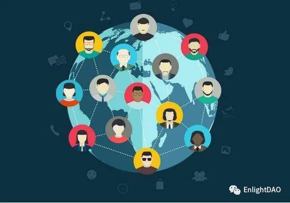
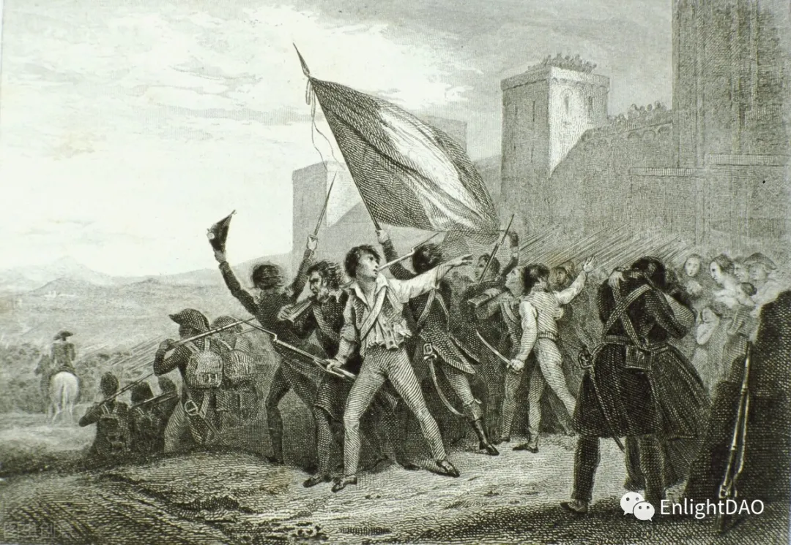

# DAO是百年未有之管理变革

管理理论有百年历史。各种理论都是彼德·德鲁克、迈克尔·波特、菲利普·科特勒等大师的注脚，并没有颠覆性的理论创新。**传统管理理论只有改良、没有变革。**

**DAO 是近年横空出世的管理名词，是对传统管理的大变革。**本文聊聊为什么 DAO 是管理的变革，以及我的变革（DAO）理想。\

### 01、什么是 DAO

**DAO（Decentralized Autonomous Organization）是去中心化自治组织。基于去中心化自治组织的管理叫 DAO 管理。**

维基百科的定义：一个完全受参与者控制的，不受任何一个集权主体影响的组织。使用公开透明的代码写成的程序进行决策。去中心化自治组织的财务交易记录和程序保存在区块链上。

所以，DAO 是由计算机编写的规则主导，不是由人主导的组织。

2013年9月，Daniel Larimer 针对比特币的不合理支出第一次提出 DAO。由于比特币不具备图灵完备性（不能在上面编程），直到2015年，具有图灵完备性的以太坊推出后，DAO 管理现身世界。

**我认为 DAO 的理想是：以区块链赋能，创造自由、公平、自治的大同世界。**

### 02、管理简史

\
**我把管理的发展分为三个阶段：经典管理、古典互联网管理、DAO管理。**

#### **第一阶段是经典管理，从20世纪初到2000年。**

1911年，弗雷德里克·泰勒出版《科学管理原理》，管理作为一个科学名词诞生了。此后，差不多每隔30年，管理理论的发展就出现一次重大变化。

1940年前是科学管理时代，强调人的经济性，以股东为中心。

1970年前是人本管理时代，重视人的社会性，以员工为中心。

2000年前是精益管理时代，寻求价值创造的全流程再造，以顾客为中心。

#### **第二阶段是古典互联网管理，从2000年至今。**

2000年前后，互联网经济风起云涌。我认为克里斯·安德森的《长尾理论》是互联网管理的开山之作。2018年，阿里总参谋长曾鸣发表《智能商业》，代表了互联网平台管理的最高境界。尽管互联网经济远超传统经济，互联网管理的书籍也多如牛毛，但是古典互联网时代的管理仍然是建立在经典管理之上，没有本质上的创新。

古典互联网解决了信息的不对称问题，是信息互联网。古典互联网最大的缺点是高度中心化，特别是数据权完全集中在平台手上，用户没有数据主权。基于区块链技术的互联网解决了信任的问题，将数据主权交还到用户手中，能够实现价值的传递，既是信任互联网，又是价值互联网。

#### **第三阶段是DAO管理，从今天到未来。**

2008年，中本聪发表《比特币，一种对等电子现金系统》，标志着区块链时代的到来。

我把区块链分为技术、经济、管理三个维度。区块链是底层技术，基于区块链技术的经济叫通证经济，其灵魂是通证，DAO则是通证经济的管理模式。区块链技术、通证经济、DAO三位一体，不可或缺。

其实，区块链技术改变的不只是经济管理，在社会管理领域也大有可为。未来应该是基于DAO管理的通证社会。

“微信读书”上还找不到一本书的书名跟DAO相关，DAO的管理理论还是空白。

### 03、为什么DAO是管理的变革

#### 从生产关系看，DAO 改变了传统的生产关系。&#x20;

经济的发展取决于生产力和生产关系。过去，在管理和科技的加持下，生产力从蒸汽机--电器--计算机--古典互联网不断进步，但是生产关系始终没变。&#x20;

生产关系是价值创造过程中人和物、人和人的关系。生产关系可分为三种，一是如何获得生产资料（融资）；二是如何创造价值（雇佣）；三是如何分配价值（法币）。&#x20;

区块链的出现，彻底改变了价值从创造到分配的全过程的生产关系。DAO 的生产关系是：全球ICO（代币首次发行）替代传统融资（IPO）、联盟替代雇佣、区块链代币替代法币。虽然目前包括中国在内的多国政府禁止 ICO，但是没有 ICO 就不能发挥区块链经济的全部优势。期待各国政府在解决 ICO 的种种弊端后，让 ICO 合规、健康地发展。&#x20;

另外，过去的生产关系是股东、员工、顾客的三足鼎立，区块链带来的则是股东、员工、顾客的三者融合。

#### 从组织形式看，DAO 颠覆了传统公司制结构。&#x20;

过去的管理有个共性，无论是手工记帐还是会计电算化，帐本都可以人为更改，帐本的可信度不高。&#x20;

区块链的技术特点决定了链上信息安全、不可篡改。因而包括账本在内的各类信息更加真实、可信。

&#x20;经济学家科斯认为，公司制的边界取决于市场交易成本跟内部交易成本的变化。区块链解决了大规模陌生人之间的信任问题，因而公司的各类交易成本大大下降。当公司的市场交易成本接近或低于公司内部交易成本时，传统公司制的组织形式将会瓦解。

_在 DAO 时代，创造价值的组织形式不再以公司制为主，而是社区，是基于共识的各类分布式自治社区。_比如，治理社区、研发社区、用户社区、投资人社区等等。&#x20;

所以，DAO 改变了生产关系，改变了公司制的组织形式。DAO 不是管理的改良，而是管理变革。

### 04、我的变革（DAO）理想

DAO 在全球刚刚起步，国外已出现一些为 DAO 服务的公链项目，比如基于以太坊的 DAOhaus，国内似乎还是空白。我想推动 DAO 在国内落地，发起一个符合中国监管政策，符合国人使用习惯的 DAO 的管理工具。这将是一个 DAO 的公链生态，一个宏大的工程。

变革（DAO）之初必须先做好两件事：一是建立基础共识，二是宏观战略规划。\

### 05、建立基础共识

\
基础共识说明什么人（价值观）一起做什么事（愿景）。

#### 价值观是：自由、坦诚、精进、共生。

自由：是根子上的人性需求。尊重自由、创造自由、分享自由是对人性最大的礼赞，任何挑战人性的企图最终都会失败。（推荐约翰·穆勒《论自由》

在 DAO 组织的人力资源管理中，最好的理念叫联盟。即个人和组织之间合作的时间、地点、形式、内容、报酬等方面都可以灵活选择，以阶段性的联盟协议约定彼此的责权利。（推荐里德·霍夫曼《联盟》）

坦诚：是对世界的基本态度。对自已坦诚、对他人坦诚才能真正地“做自已”。（推荐金·斯科特《绝对坦率》）

精进：学习力是唯一的核心竞争力，对个人、对组织皆然。未来需要的知识在未来，只有持续精进才能保持核心竞争力。链圈一日、人间十年，要创造一个有价值的 DAO 生态，第一推动力就是学习力。（推荐卡罗尔·德韦克《终身成长》）

共生：一个人跑得快，一群人走得远。DAO 生态是个伟大的工程，需要无数有共同信仰（共识）的人共同创造、共同生长。（推荐陈春花《共生》）

愿景包括近景和远景。

近景：在学习场景落地应用 DAO（读书会、新职业培训等）。

远景：基于共识程度高的知名公链，开发偏国内的 DAO 基础设施。\

### 06、宏观战略规划

我把DAO的变革分为三个阶段：觉醒年代、战争年代、和平年代。

觉醒年代：区块链技术布道、通证经济布道、DAO 治理布道。特别是 DAO 的理念的传播、探讨，找到共创伟业的同志。觉醒年代重点完成两件事：区块链培训机构良性发展，DAO 的公链1.0版主网上线。

觉醒年代大概需要1-2年。

战争年代：从各类社区搭建、基础公链研发开始，以卓越的运营迭代发展，在公链战争中成长为最健壮、最完备的 DAO 生态。

战争年代大概需要3-5年。

和平年代：在江湖地位确立后，能够健康良性地自我发展，早期发起人可以隐退，从最初的中心化发展为成熟的去中心化生态。和平年代未必是完全去中心化，但一定是多中心化、弱中心化。从传统管理的制度理性过渡到区块链治理的技术理性，实现 DAO 的理想：自由、公平、自治。

和平年代大概是在6-7年后。

### 07、寻找同志，共创伟业

DAO 管理是百年未有之管理变革。前无古人，期待来者。如果你是同志，请关注我们，共创伟业。\
\
