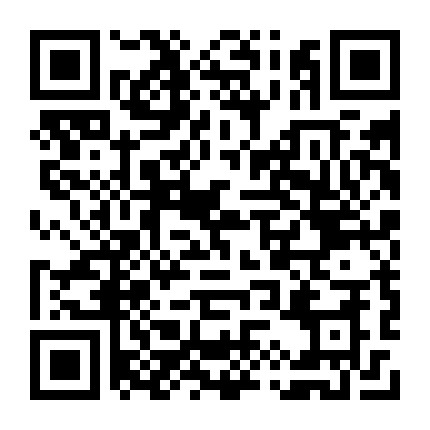

# 宣布一个好消息，EnlightDAO数字经济新学习社区成立了

EnlightDAO EnlightDAO 2021-09-07 17:40

****

大家好，这是EnlightDAO公众号发布的第一篇文章。

\
我们想和大家分享一个消息，**EnlightDAO**，一个以DAO(Decentralized Autonomous Organization)作为治理模式的数字经济新学习社区正式诞生了。

EnlightDAO是实验性社区，和传统学习社区有着本质的区别：

* **国内首批尝试以DAO模式运行**，聚焦数字经济的**在线学习社区**；\
  课程将主要围绕**区块链原理、区块链应用和DAO学习**，将提供数字经济领域的系统性、结构化课程，强调理论+体验+实践，**填补数字经济在线教育的空白；**
* **认可并奖励广泛的价值创造。**不论你是社区的课程设计者、讲师，还是社区的运维者，又或者是正在学习课程的学习者，我们承认每个人做出的贡献，并将**建立链上机制来奖励所有做出贡献的社区成员**；
* 让更多人了解DAO的实践和应用，开发DAO基础设施，构建**web.3.0的新型商业生态**。

### &#x20;**01、为什么选择DAO的治理模式？**

17世纪东印度公司成立以来，**公司制**改变了人类社会的协作方式。从**分散、低效、原始**的协作方式，逐步演变成**中心化、高效的**协作方式。

而**互联网公司**指数式快速增长，市值超越传统企业巨头，也使得**公司制的组织形式发展到巅峰**。

但巅峰之下，高度中心化所带来的弊端和矛盾也越来越凸显。

信任缺失、数据霸权加剧，**互联网平台和生态建设者**的冲突加剧（比如淘宝和卖家、美团和骑手、滴滴和司机、阅文集团和作者）；

\
公司间竞争导致**行业愈加内卷**、管理者愈加疲惫、员工996和35岁焦虑；

**用户被海量真假信息冲击**、N方博弈导致的N输，每个人都被困在系统里，动弹不得…

\

随着互联网发展进入下半场、红利消失，我们需要**全新的组织协作方式**，而这种协作方式必然要能够**触及到数字经济的本质**。

\
DAO（Decentralized autonomous organization ），作为区块链技术应用的一种形式，一种**全新的人类组织协作方式**，**将带来生产关系的彻底变革**。它是由达成同一共识的群体自发产生的共创、共建、共治、共享的协同行为。\

\

在DAO治理模式下，将**不会有一个人像公司里的领导一样对你进行全方式的打压**，你可以选择早九晚五以外的工作方式，管理层将**从看门人的角色转变为推动者**的角色。

区块链技术又为社区的治理提供信息透明化和维持治理的工具，给构建海星式组织提供更大的可能，最大程度上避免层级制的形成。

### **02、EnlightDAO学习社区：让少数人提前参与未来**

\
我们已经看到未来数字世界的雏形，**未来已经到来，只是尚未流行。**

大数据、人工智能、5G、区块链等技术兴起，已经掀起数字化浪潮。其中，**区块链作为能够变革生产关系的技术，将是数字经济的抓手。**

Don Tapscott，数字经济之父、《区块链革命》一书作者，在TED演讲时表示，**区块链将是下一代互联网**：

> `“未来几十年可能带来巨大变革的技术，已经到来了。而这种技术，不是社交媒体，不是机器人科学，甚至也不是人工智能。你会惊讶地了解到，它是比特币等数字货币的技术基础，叫做区块链。”`

\
的确，过去几年，我们已经看到**区块链企业数量逐年上升**，对**技术、产品、运营等区块链复合型人才的需求**非常巨大。

目前，**很多人对区块链还没有基本的了解。**说起区块链，有人会直接把它和比特币画上等号，断定是泡沫或者是投机；也有部分人，对区块链的学习抱着畏惧之心，觉得入门太难。

基于这样的认知，EnlightDAO社区早期将主要提供区块链相关的课程学习。

通过**系统化、趣味化、实践化的课程和内容**，为新手提供了解区块链/web3/DAO的途径，帮助社区成员参与到区块链变革大潮中来，实现**「Learn to Earn」**。

这里 Earn 是广义的，可能使能力提升、不再恐惧、掌控自我、结识朋友，也可能是荣誉证明、经济回报等。

\
对于课程的开发，在内容结构上，我们**整合现有零散的区块链知识，输出具有系统化和结构化的内容**；

形式上，我们将通过**理论+体验方式、学分+NFT**的任务机制，帮助成员更好的理解知识；

实践上，我们希望学习者本身建立起**一套输入、消化处理、创造和输出的机制**。

价值创造是EnlightDAO学习社区的终极目标，但是我们不想狭隘化这种价值。

**如果你想通过和学习者交流来提升自己的学习热情**，当你开始喜欢上学习就是你的价值创造；

**如果你真的想成为一个区块链产品经理**，真正能设计出一款区块链产品并实现才叫你的价值创造；

**如果你想成为一个DAO研究者**，写出一份研究报告才叫你的价值创造；

**如果一个创意能通过DAO实现**，在社区发起一个实现这个创意的DAO就是你的价值创造。

\
在EnlightDAO，你希望创造的价值由你自己来定。这意味着你需要一个学习目标，而这个目标可以随着你的认知和成长去调整、变化。

### **03、EnlightDAO的社区文化&价值奖励机制** 

**我们的价值观是：自由、坦诚、精进、共生。**

****

**自由：**是根子上的人性需求。尊重自由、创造自由、分享自由是对人性最大的礼赞，任何挑战人性的企图最终都会失败。

在DAO组织的人力资源管理中，最好的理念叫联盟。**即个人和组织之间合作的时间、地点、形式、内容、报酬等方面都可以灵活选择，**以阶段性的联盟协议约定彼此的责任、权利。\

**坦诚：**是**对世界的基本态度**。对自已坦诚、对他人坦诚才能真正地“做自已”。\

**精进：学习力是唯一的核心竞争力**，对个人、对组织皆然。未来需要的知识在未来，只有持续精进才能保持核心竞争力。要创造一个有价值的DAO生态，第一推动力就是学习力。\

**共生：**一**个人跑得快，一群人走得远**。DAO生态是个伟大的工程，需要无数有共同信仰（共识）的人共同创造、共同生长**。**\

**我们认可并奖励广泛的价值创造。**

正如在本文最开始提到的那样，EnlightDAO和其他的在线教育培训平台、社区不同的是，EnlightDAO社区认可广泛的价值创造。\

不论是社区的发起人、课程的设计者、讲师、运维者、又或是正在学习课程的学习者，所有人都是社区的一员，**只要创造价值，就值得被认可和奖励。**\

如果你想**系统化学习区块链入门内容**，通过实践获得真实的数字资产等体验；

**提前布局区块链或数字货币投资**，收获理性深度的认知体系；

**兼职参与区块链项目（Bounty）**，成为“项目股东”的数字游民；

**长期入行区块链或数字经济行业**（DeFi、NFT、产业区块链等）。

\

关注“EnlightDAO”的公众号，我们会定期分享**区块链行业资讯和分析文章**，EnlighDAO社区的第一门**区块链和数字资产从0到1实践营**正在招募中，可滑到最后查看课程目录和报名方式。

\

**社区发起人（排名不分先后）**

****

**军哥**\
南京大学 EMBA；

学习力信仰者，多个学习型社区发起人、联合发起人；

互联网连续创业者，多知名企业高管；

****

**NinaDou**\
英国布里斯托大学密码学硕士，在线教育从业者；

是中国最早的DAO社区DAOONE的联合发起人；\
曾任全球著名的区块链项目社区Status的中国区经理；

**六木**\
中山大学在读女博士，区块链产业应用研究方向；

是中国最早的DAO社区DAOONE的联合发起人；\
曾负责顺丰区块链从0到1项目，拥有丰富的区块链实战经验；

**Joel**

中国最早的DAO社区DAOONE的联合发起人；

硅谷软件公司研发主管，熟悉多种编程语言以及智能合约开发；

**江南西道**

现任全球著名的区块链项目社区Status的中国区经理；

Bitfwd 等5+区块链社区长期贡献者；全球DAO项目研究者、布道者；

\
**咚咚咚**&#x20;

互联网大厂10年运营，区块链追光者；

**擒龙**

硕士研究生毕业，区块链实际应用研究方向；

**浩哥**

正念书会发起人；

**军**

硕士毕业，区块链+隐私计算研究方向；

**渐冻人**

亚太区块链理事会理事，百名发起人之一DAOONE的联合发起人，企划广告人；\

**Jamee**

互联网运营人，南大翻译硕士；

对区块链有热情的新人，也许我走得不快，但每一步都很踏实；

**无小维**

前字节跳动产品经理，在线教育业务负责人，创业者；

对区块链充满好奇，希望能在这波浪潮中往前多挤挤；

**一石**

跨界营销管理实践者，多领域头部企业高管；

坚信“当下世界正趋向信息无限透明，宇宙的一切信息都已向人类展示”；

**阳子**

互联网猎人，户外爱好者；

**曾真律师**

泰和泰（南京）律师事务所合伙人，擅长企业法律服务及动态股权架构设计；

**Cloud**

世界五百强企业十年从业经历；

《零基础学区块链》作者；

**晨曦**

连续创业者，8年左右创业旅程，在内在成长和自我修养这条路上不断学习精进；

国际DFA认证高级花艺师；

**李兆娜**

会计师、税务师，孜孜不倦的会计人；

爱养生，爱瑜伽；喜欢接受新生事物。

### **04、面向小白的区块链和数字资产入门实践营**

#### 课程亮点 Hilights

✅ 技术小白也能学的区块链入门课程

✅ 体系化课程设计，搭建区块链和数字资产的知识和实践框架

✅ 专业讲师直播授课，在线实时互动

✅ 理性、不传递焦虑、富有实践精神的区块链学习社群

\
**课程目录 Content**

Week 1 《区块链：数字时代变革与普通人机遇》&#x20;

&#x20;   \* 数字时代的危机与新生产关系

&#x20;   \* 区块链技术原理和变革性意义

&#x20;   \* 区块链和数字货币发展史

&#x20;   \* 数字资产大航海时代和普通人机遇

&#x20;   \* 赛博朋克宣言和下一代互联网

\
Week 2 《上帝区块：比特币》

&#x20;   \* 一场开源货币实验

&#x20;   \* 比特币技术、金融、共识

&#x20;   \* 各国政策和资本布局

&#x20;   \* 比特币的生态参与者

&#x20;   \* 常见问题和风险（比如价格波动）

&#x20;   \* 实践&作业：钱包和区块浏览器

\
Week 3 《世界计算机：以太坊》

&#x20;   \* 多视角了解以太坊：避免盲人摸象

&#x20;   \* 区块链和以太坊的关系是什么？

&#x20;   \* 以太坊的运行方式：以一笔交易的实现为例

&#x20;   \* 传统应用VS以太坊应用

&#x20;   \* 实践：插件钱包 & web3.0应用

Week 4 《联盟队：产业区块链》

&#x20;   \* 产业区块链发展概述

&#x20;   \* 联盟链技术及应用

&#x20;   \* 联盟链应用详解

&#x20;   \* 产业区块链未来的发展

&#x20;   \* 实践：产业区块链产品体验

Week 5 《百花齐放：各类加密资产》

&#x20;   \* 加密资产定义和风险

&#x20;   \* 虚拟货币类详解：狗狗币、泰达币

&#x20;   \* 公链类详解：波卡、币安智能链

&#x20;   \* 协议类详解：Filecoin、Uniswap

&#x20;   \* 元宇宙N类详解：Crypto punk、Axie Infinity

&#x20;   \* 实践&作业：收获本期训练营NFT课程完课证书

\
课程咨询或报名，请扫码添加 EnlightDAO 小盒子，或查看原文\~

